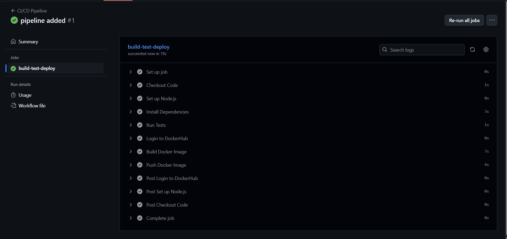
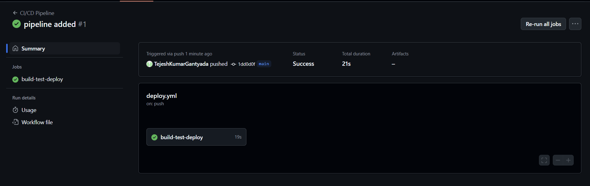
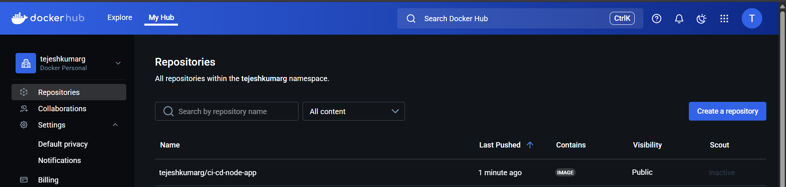

# 🚀 Node.js CI/CD Pipeline with GitHub Actions & Docker

This project demonstrates a complete CI/CD pipeline for a Node.js app using **GitHub Actions** and **Docker**. The pipeline runs automated tests, builds a Docker image, and pushes it to Docker Hub on every push to the `main` branch.

---

## 🯡 Prerequisites

* Node.js & npm installed
* Docker Desktop installed
* GitHub account
* Docker Hub account

---

## 📁 Project Structure

```
ci-cd-node-app/
├── .github/workflows/deploy.yml     # CI/CD workflow
├── Dockerfile                       # Docker config
├── index.js                         # Sample Node.js app
├── sum.js                           # Sample module
├── sum.test.js                      # Unit test using Jest
├── package.json
├── .gitignore
└── README.md
```

---

## 🛠️ Getting Started

### 1. Clone the repo or create a new project

```bash
git clone https://github.com/your-username/ci-cd-node-app.git
cd ci-cd-node-app
```

### 2. Initialize a Node.js app

```bash
npm init -y
```

### 3. Create `index.js`

```js
const http = require('http');

const PORT = 3000;
const server = http.createServer((req, res) => {
  res.end("Hello from CI/CD App!");
});

server.listen(PORT, () => {
  console.log(`Server running at http://localhost:${PORT}`);
});
```

---

## ✅ Add Unit Tests

### 1. Install Jest

```bash
npm install --save-dev jest
```

### 2. Create `sum.js` and `sum.test.js`

**sum.js**

```js
function sum(a, b) {
  return a + b;
}
module.exports = sum;
```

**sum.test.js**

```js
const sum = require('./sum');

test('adds 1 + 2 to equal 3', () => {
  expect(sum(1, 2)).toBe(3);
});
```

### 3. Update `package.json`

```json
"scripts": {
  "test": "jest",
  "start": "node index.js"
}
```

---

## 🐳 Dockerize the App

### 1. Create Dockerfile

```Dockerfile
FROM node:20-alpine

WORKDIR /app
COPY . .

RUN npm install

CMD ["npm", "start"]
```

### 2. Build and run locally

```bash
docker build -t ci-cd-node-app .
docker run -p 3000:3000 ci-cd-node-app
```

> Visit `http://localhost:3000` → You’ll see `Hello from CI/CD App!`

---

## ☁️ Push Code to GitHub

```bash
git init
git remote add origin https://github.com/your-username/ci-cd-node-app.git
git branch -M main
git add .
git commit -m "Initial commit"
git push -u origin main
```

---

## 🔐 Set GitHub Secrets

1. Go to your GitHub repo → **Settings > Secrets and variables > Actions**
2. Click **New repository secret** and add:

   * `DOCKER_USERNAME` → Your Docker Hub username
   * `DOCKER_PASSWORD` → Your Docker Hub password or access token

---

## ⚙️ Setup GitHub Actions Workflow

### 1. Create directory

```bash
mkdir -p .github/workflows
```

### 2. Create `.github/workflows/deploy.yml`

```yaml
name: CI/CD Pipeline

on:
  push:
    branches: [main]
  pull_request:
    branches: [main]

jobs:
  build-test-deploy:
    runs-on: ubuntu-latest

    steps:
    - name: Checkout code
      uses: actions/checkout@v3

    - name: Set up Node.js
      uses: actions/setup-node@v3
      with:
        node-version: '20'

    - name: Install dependencies
      run: npm install

    - name: Run tests
      run: npm test

    - name: Log in to Docker Hub
      uses: docker/login-action@v2
      with:
        username: ${{ secrets.DOCKER_USERNAME }}
        password: ${{ secrets.DOCKER_PASSWORD }}

    - name: Build Docker image
      run: docker build -t your-dockerhub-username/ci-cd-node-app:latest .

    - name: Push Docker image
      run: docker push your-dockerhub-username/ci-cd-node-app:latest
```

> Replace `your-dockerhub-username` with your actual Docker Hub username.

---

## 🚀 Run the Pipeline

Push code to GitHub:

```bash
git add .
git commit -m "Added CI/CD pipeline"
git push origin main
```

> Go to GitHub → **Actions tab** → You’ll see your workflow running 🎉
> 
> 
> 

---

## 🔍 Verify the Image on Docker Hub

Check your [Docker Hub repository](https://hub.docker.com/repositories) to see the image `ci-cd-node-app` pushed automatically.

---

## 🛠️ Jenkins Version

If you want a **Jenkins CI/CD pipeline** version of this project, get it here:
👉 **[Jenkins CI/CD Pipeline Repo](https://github.com/TejeshKumarGantyada/4-cicd-pipeline-with-jenkins)**

---
